# ✍️ Handwriting Authorship Identification Using CNNs 

## Motivation
This repository holds an attempt to apply transfer learning techniques and convolutional neural nets (CNNs) to model and predict the identity of the writer of a given handwritten image from the [CSAFE Handwriting Database](https://data.csafe.iastate.edu/HandwritingDatabase/?saveQueryContent=handwritingdbstudy-%3E++%28Writer_ID+%3C%3D+%270090%27%29+&files%5B%5D=&study=handwritingdbstudy&left-operands-parameters-name=Writer_ID&filter-operators-name=%3D&right-operands-parameters-value=Writer_ID&paramValues=0009#). This is intended to give insight into the potential applications of deep learning models in handwriting analysis with broad use in fields such as forensics, fraud detection, and historical document analysis.

<br> 

## Overview
Handwriting author identification is important in forensic science, fraud detection, and document authentication. Traditional handwriting analysis depends on expert judgment, which can be subjective and time-consuming. This project explores whether deep-learning provides more consistent and scalable approaches to identifying writers from handwriting samples. Using the CSAFE Handwriting Database, which contains 475 individuals and 12,825 samples, author identification was framed as a multi-class image classification problem. Handwriting images were preprocessed and standardized to 384×384 formatting and divided into training, validation, and test sets. Convolutional neural networks with transfer learning were trained to classify samples. Initial 90-writer subsets achieved test accuracies between 72% and 78%. Larger-scale experiments using all data showed similar performance and achieved top-3 accuracies up to 90%. Because forensic applications require both accuracy and justification, this project emphasized explainable AI. Two explainability methods, Grad-CAM and LIME, were used to interpret predictions. These revealed that models sometimes relied on irrelevant features, such as white space and page margins, rather than handwriting characteristics, suggesting some predictions may not be based on trustworthy reasoning. To mitigate effects of possible confounding features, black & white color grading was applied to all images; models trained with this constraint achieved top-3 accuracies of 73% to 85%. These findings highlight the potential and limitations of AI-based handwriting identification. While deep-learning can improve efficiency, explainability is essential for ensuring systems are reliable for real-world applications.

<br> 

##
## Summary of Work Done

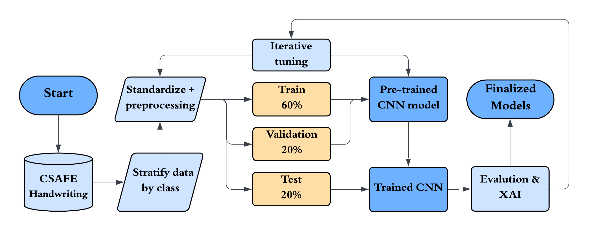

Figure 1: Basic workflow flowchart.

### Data

* Source: data can be downloaded from the [CSAFE Handwriting Database webpage](https://data.csafe.iastate.edu/HandwritingDatabase/?saveQueryContent=handwritingdbstudy-%3E++%28Writer_ID+%3C%3D+%270090%27%29+&files%5B%5D=&study=handwritingdbstudy&left-operands-parameters-name=Writer_ID&filter-operators-name=%3D&right-operands-parameters-value=Writer_ID&paramValues=0009#) (version 5)
* Type: image data, scans of handwriting samples; .CSV file containing metadata on each writer is also included when downloading the data.
* Size: approx. 5GB, though data was split into 4 zip files of approx. 1GB each to comply with Colab data upload limitations
* Instances: 12,825 images, 475 classes (authors)

<br>

### Exploratory Data Analysis (EDA)

The dataset contains 12,825 high quality image scans of handwriting samples from 475 individuals.

  * 475 classes (authors), 27 images each
  * Each class is organized as such:
    * 3 different, conserved prompts (LND, WOZ, PHR) written 9 times each by each author
    * The 9 instances of each prompt were written across 3 different sessions
    * 3 repetitions of each prompt were made per session
    * All above aspects are described by image's file name; e.g., `w0028_s03_pWOZ_r02.png` is writer **w0028**'s second repetition of the **WOZ** prompt in the third session
      * The above naming system made filtering and organization simple through python scripts (i.e., `reload_data2.py`).
    
		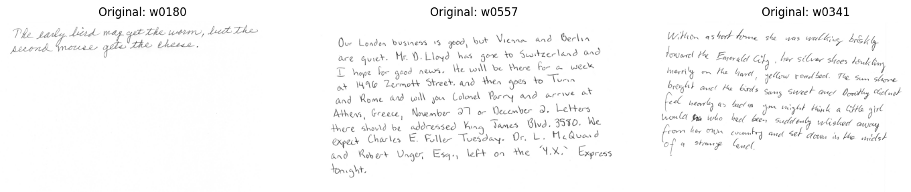

		Figure 2: Examples of each prompt (left to right): PHR (proverb/phrase), LND (the London Letter), WOZ (excerpt from *The Wizard of Oz*).

Majority of images are in grayscale and are rectangular, about 2,500×2,800 pixels, though some are cropped directly to the text regions; both cases caused stretching/compression when images were downsized for modelling. 

 <br> 
 
### Data Preprocessing

Majority of preprocessing involved directory management and organizing image data dumped from downloaded zip files into writer sub directories, and further nesting writer sub-directories in stratified random train/validation/test splits. Many of these were for clarity and ease of navigation, but also natural handling for tensorflow's `image_dataset_from_directory` functoion. Minor augmentations were attempted at separate stages of the pipeline (random crop), though were each time rejected since they negatively affected performance. Image-level preprocessing used in late-stage models:
* Padding or cropping white space from the bottom of images to make them square
  * This was to prevent stretching/compression that would occur when the image was non-square
  * The bottom of the image usually held the most empty/white space, so this method did not observably cut off any handwritten text
* Preemptively downsizing to the model-required resolution (usually 384×384)
* Black & White color grading; hard-coding each pixel to be black or white based on a set threshold
  * Images were originally in grayscale, though processed as RGB to fulfill transfer model input requirements (usually needing 3-channel inputs)
  * Mid-stage models' Grad-CAM showed overreliance on margins and whitespace, so to mitigate the possiblility of shadows or other artifacting, all images were converted to this color binary
  * It was considered whether this would remove information (e.g., whether stroke darkness contributed to predictions) from tge dataset, but was considered a necessary preprocessing step for due diligence toward the cleanliness of the data
* Pixel values were normalized to [-1, 1] using `mobilenet_v2.preprocess_input` 

All preprocessing steps were performed on all images, including testing images, since these are quality-based and cleaning steps. There is no conceivable source of data leakage that would usually discourage preprocessing steps from being applied to validation and test sets.

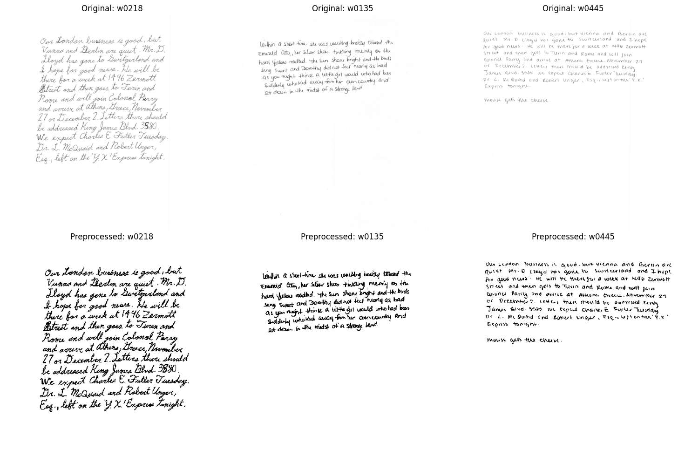

Figure 3: Examples of unprocessed and processed images.


Some preprocessing and cleaning steps were performed on the supplementary metadata .CSV file `data/Handwriting_Metadata_clean.csv`, and are enumerated in `notebooks/Progress3/DeploymentPrep.ipynb`. The original file contained 13 features; most of which were dropped to leave only the writer id column (wid) and three demographic features: age group, handedness, and gender. Any missing values within these columns were filled in with "unknown".

<br> 

### Modelling Approach

#### **Models:** 

Convolutional neural networks (CNNs) were used for their natural image handling capabilities. Transfer learning techniques utilizing the **tensorflow** and **keras** libraries were harnessed for modelling.

* Baseline model: EfficientNetB0
  * Initial modelling phase tested ResNet50V2, EfficientNetB0, and MobileNetV2 (these were chosen based on preliminary research into the `keras` library)
  * EfficientNetB0 seemed to balance size and performance and was used in early model trials
* Final model: MobileNetV2
  * Primary model choice
  * Backbone frozen
  * Additional GlobalAveragePooling2D and Dense layers with softmaxing added to customize classifier
  * Dropout layer added to mitigate overfitting observed in early models
* Heavier models: attempted heavier & deeper architectures
  * e.g., DenseNet169 & ConvNeXtTiny
  * These did not match MobileNetV2's performance

    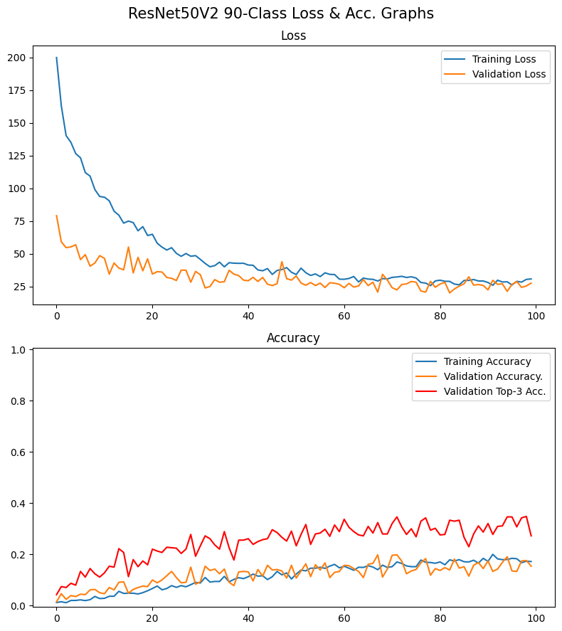

    Figure 4: Loss & accuracy curves from ResNet50 model, showing low training accuracy.
  * Shown in `notebooks/Progress3/OtherCNNs.ipynb`
* Custom CNN: 4-layer CNN was built and tested though failed to train, likely due to shallow/light architecture
  * Shown in `notebooks/Progress2/AllClass+CustomCNN.ipynb`

#### **Training Split(s):** 
* Used in accordance with stratified random sampling to ensure each class was equally represented in each set.
* Primary train/validation/test split: 15/6/6 (approx. 60/20/20 ratio)
* Prompt-based splits: 9/9/9 (33/33/33 ratio)
  * Splitting classes according to prompt (i.e., LND, WOZ, PHR)
  * Either randomly assigned per author or consistently organized within train/vaidation/test sets
* In `AllClass7_NoPHR.ipynb`, where all **PHR** samples (the shortest prompt) are removed from dataset (leaving 18 samples per class), the split 10/3/5 is used

<br> 

### Model Training

* Epochs: 70-100
* Batch Size: 64
* Image Size: 384×384
  * Other sizes were tested, such as 224×224 and 442×442; performance increased with higher resolutions, and 384×384 was chosen for balance between performance and computational costs
    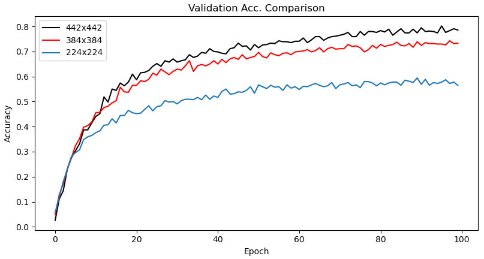

    Figure 5: Accuracy curve comparing model performance at different resolutions.
  * A resolution of 442×442 was kept for late-stage 90-class models, such as `HighRes3.keras`
* Learning Rate: default Adam optimizer (1e-3)
* Hardware: A100 GPU provided by Google Colab
* "Typical" loss & accuracy curve
	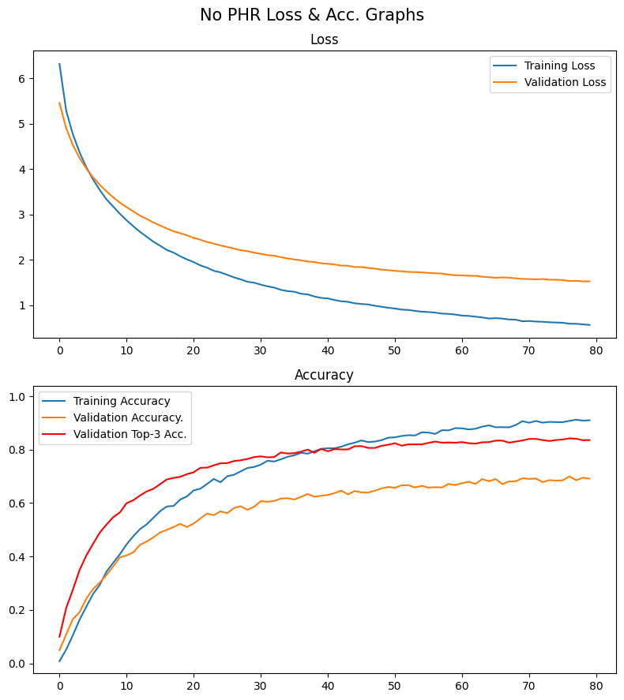

Figure 6: Loss & accuracy curve of Model #7, showing top-3 accuracy as well; most late-stage models have similar curves.

*All loss and accuracy training data can be found under the `results/` directory as .CSV files.*

<br> 

##
## Results

Accuracy was the main metric chosen for evaluating models since all classes are equally represented and the multiclass nature of the problem made macro-precision or F1-scores less intuitive. Later models were also evaluated based on top-3 accuracy, which checks whether the correct prediction was represented within the top 3 guesses. This metric was chosen since it was more forgiving than raw accuracy, considering there are 475 different "options" to choose from.

Table 1: Metrics across late-stage models.

| | Model #2 | Model #3 | Model #4 | Model #5 | Model #7 |
| :--- | :---: | :---: | :---: | :---: | :---: |
| **Train Accuracy**  | 88% | 91% | 95% | 82% | 91% | 
| **Val. Top-3 Acc.** | 83% | 86% | 90% | 74% | 84% |
| **Test Accuracy**   | 67% | 71% | 77% | 56% | 67% | 
| **Test Top-3 Acc.** | 82% | 86% | 90% | 73% | 84% | 

<br> 

As the above table shows, models performed well. Considering they are significantly greater than the random rate (approx. 0.2%), this suggests models are able to pick up nontrivial signals toward authorship identification. This supports the use of AI methods in this sphere of document analysis.

<br> 


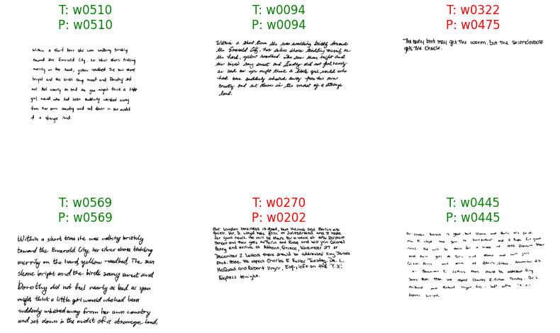

Figure 7: Example test output from Model #5/AllClass5

*(Note: reflects raw accuracy scores and does not score according to top-3 accuracy)*.

<br>

Earlier investigation into predicting demographic features (i.e., age, gender, handedness) based on handwriting was attempted and results were found to be trivial. 

Table 2: Metrics across demographics-based models (included in the `models/` directory) and a 90-author model for comparison.

| Target Var. | Train Acc. | Test Acc. | Major Class % |
| :--- | :---: | :---: | :---: |
| **Gender**     | 69% | 72% | 60% |
| **Age**        | 65% | 64% | 33% |
| **Handedness** | 90% | 89% | 90% |
| **Authorship** | 86% | 79% | 1.1% |

<br> 

Data for demographic features (outlined in `data/Handwriting_Metadata_clean.csv`) tended to be imbalanced. For example, about 90% of the data was from right-handed people (reflecting real-world approx. ratios), and a model trained to predict handedness yielded 90% accuracy after less than 10 epochs, which is almost equivalent to labelling everyone as right-handed, implying the model was not truly "learning" anything based on the handwriting features. This contributed to focusing on *authorship* as a target variable despite its lack of greater generalizability.

<br>

### Model Interpretation

Grad-CAM and LIME were applied as explainable AI techniques to aid in the interpretability of late-stage CNNs, which are notoriously black-box architectures. *Grad-CAM* creates a heatmap of model "focus" over the image, depicting what most contributes toward predictions. *LIME* jitters pixel values and evaluates whether changes were beneifical or harmful toward model predictions to highlight privotal areas of importance. These aided in improving the robustness of the model and pipeline.


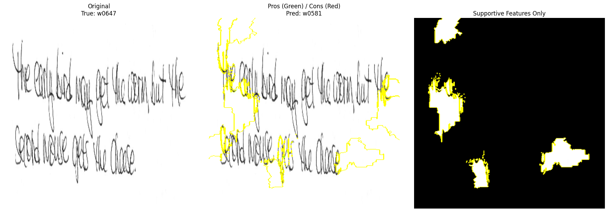

Figure 8: Example LIME output from Model #1, prior to squaring/standardizing through cropping and padding whitespace, showing the image getting distorted to accomodate the input requirements of the model, showcasing this early oversight. After this (excluding Model #3), the padding/cropping preprocessing step was added. In addition, the LIME outputs showed random/jagged/nonsensical areas of importance (outlined in yellow). This pattern was conserved within the majority of later models, and also manifested within white space often, supporting some Grad-CAM insights, yet suggesting LIME is not an optimal method for this problem.

<br>  

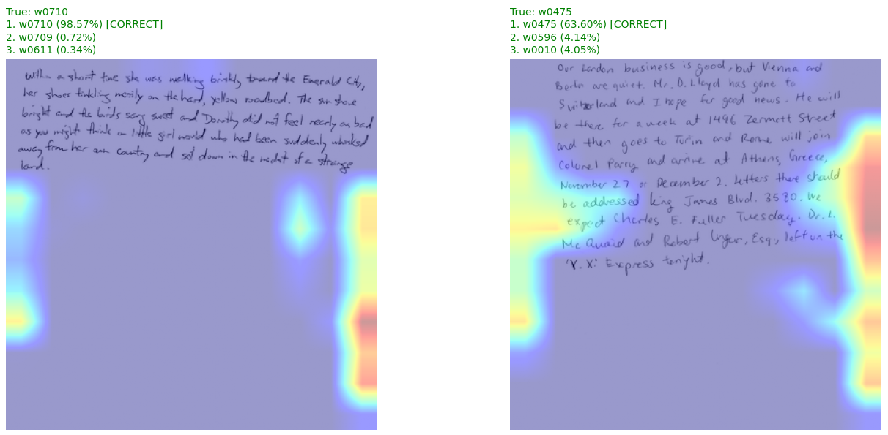

Figure 9: Example Grad-CAM map from Model #4/AllClass4, showing correct predictions despite not "looking" at the text regions, casting doubt on the predictive logic of the model. This led to the incorporation of black & white color grading.

<br>

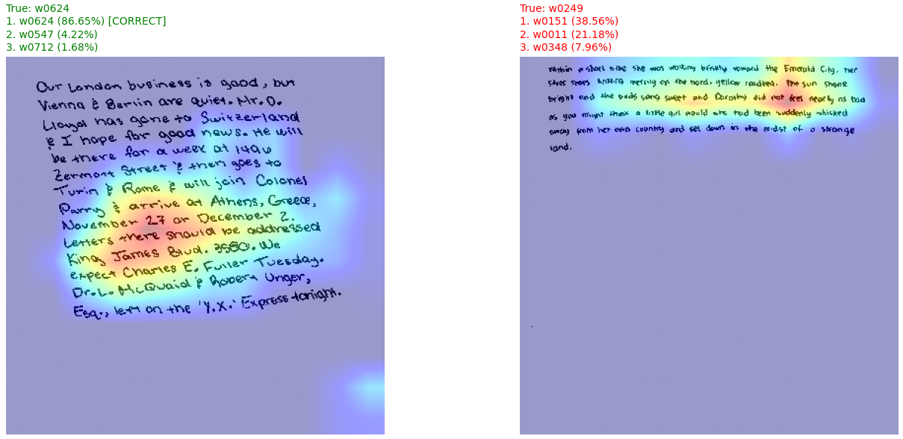

Figure 10: Example Grad-CAM map from Model #5/AllClass5_bw, after black & white color grading was administered, closer adherence of model "attention" to text areas. This increases confidence in modelling predictions and grounds them more reliably in the actual data, making the model more trustable.

<br>

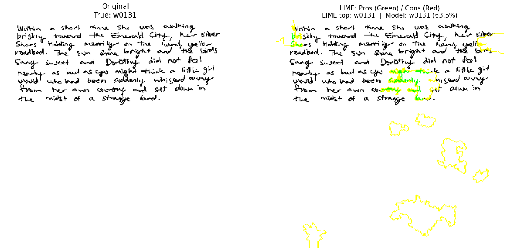

Figure 11: LIME output from Model #7/AllClass7_noPHR. Like earlier LIME graphs, areas of importance seem randomly scattered across the bottom of the image, within the whitespace, though "positive" areas highlighted in green are more represented as well.

<br>

### Key Insights

* Demographic features (i.e., age, handedness, gender) were not found to be feasibly predicted based on handwriting characteristics
* Higher image resolution (i.e., up to 442×442) consistently improved model performance
* Prompt-based train/validation test splits produced overfitting and lower performance, suggesting the model relies on intra-class consistency and that prompt length meaningfully affects classification performance, a potential concern for real-world generalization
  * A run with all PHR prompts across all authors sorted into the validation set showed normal performance in the train and test sets and stunted performance in the validation set
  * Shown in `notebooks/Thirds_Reattempt.ipynb`
* Grad-CAM revealed that correct predictions are not always grounded in handwriting features; some models focused on page margins and white space, raising red flags relevant to forensic use
  * While white space and margin size are valid features for handwriting analysis, the model showed an overreliance on these areas of the image, which did not yield reliability
* Black & white color grading reduced potential confounding elements (e.g., shadows, scanner artifacts) and improved the trustworthiness of model attention maps
* Top-3 accuracy is a more meaningful evaluation metric for this problem given 475 classes; final models achieved up to 73%—84% top-3 accuracy
  * Supports use of similar models as decision-support tools for reducing and expediting analysis workloads
  * Can limit the "suspect" pool

<br>

### Conclusion

This project demonstrated that MobileNetV2 with transfer learning can identify handwriting authors from scanned samples at a rate far exceeding chance, reaching top-3 test accuracies between 73% and 90% across a 475-class problem, providing meaningful support for the use of deep learning in document analysis workflows. However, predictive performance alone proved insufficient as a measure of model quality. XAI analysis via Grad-CAM revealed that correct predictions were not always grounded in genuine handwriting features, with earlier models showing overreliance on page margins and whitespace. This emphasizes, for forensic and other high-stakes applications, that how a model reaches a prediction matters as much as whether it is correct. Incorporating black & white color grading as a preprocessing step meaningfully improved the interpretability of model attention, basing predictions more reliably in the actual handwriting. Overall, this pipeline establishes a strong foundation and proof-of-concept for AI-assisted handwriting identification, while also highlighting that explainability must be a first-class concern in any forensic application of machine learning.

<br> 

### Future Work

As, in its current form, the setup of the pipeline makes it a closed-set problem (i.e., writers outside of the training set cannot be predicted without additional appropriate training data), shifting focus from CNNs to Siamese Neural Networks (SNNs) is the next frame of focus. SNNs are designed to take two inputs and compare them against each other, and with all that was learned from the current pipeline regarding data cleaning and proper image handling specific to handwriting analysis, this would be the natural progression to testing the utility of deep learning and AI applications in digital forensics and other such spheres, and "opening" this problem (i.e., making it more generalizable). Other aspects to dive deeper into are more extreme augmentations and image processing steps. Augmentations have not been applied to any finalized models since, whenever executed, they worsened performance. However, applying different forms of augmentation (such as cropping to focus on words or letters rather than entire paragraphs) is yet to be tested. This would also serve to yield more data and inflate the training set.

<br> 

##
## Repository Structure Explanation

### How to Run
#### **Generating final model:**

Download data from the [CSAFE Handwriting Database](https://data.csafe.iastate.edu/HandwritingDatabase/?saveQueryContent=handwritingdbstudy-%3E++%28Writer_ID+%3C%3D+%270090%27%29+&files%5B%5D=&study=handwritingdbstudy&left-operands-parameters-name=Writer_ID&filter-operators-name=%3D&right-operands-parameters-value=Writer_ID&paramValues=0009#). Clone this repository, or download `BW_coloring.ipynb` (or `AllClass7_NoPHR.ipynb` or `HighRes_Reattempt+Comparison.ipynb`) from the `notebooks/` directory. It is recommended to execute code virtually, such as with Google Colab, ensuring dependencies, such as `data/reload_data2.py`, are within the same/virtual directory. Run notebook and download .keras model and other output files; XAI interpretations are built into this notebook and require the `data/Handwriting_XAI3.ipynb` module to run. Previous models can be trained and generated in the same way with their respective notebook(s).


#### **Deployment:**

Two browser-based local deployment versions are available.
*  `475class_deployment.py` showcases a model trained on all authors
*  `90class_deployment.py` showcases a subset of authors with a higher accuracy model

Both versions require the same dependencies, enumerated in `requirements.txt`. Clone this repository, install the required modules, and run either script locally. CLI command shown below:

```
git clone https://github.com/[your-username]/DATA4381_HandwritingIdentification/
cd DATA4381_HandwritingIdentification
pip install -r requirements.txt
cd deployment
streamlit run [deployment.py file of choice]
```

<br>

### Contents of Repository
* **notebooks**: contains current code progress
  * *previous work*: subfolder containing initial modelling attempts; full documentation can be found in [this repository](https://github.com/zaisid/DATA4380_Vision)
  * *CapstoneI*: subfolder containing baseline models
  * *Progress 1-3*: subfolders containing mid- and late-stage modelling
* **data**: contains metadata, modules, and select model-specific test set data
* **images**: contains graphs and visualizations generated throughout pipeline, including loss/accuracy curves, test outputs, and Grad-CAM maps, split into subfolders in similar accordance with the organization of the **notebooks** directory and naming conventions found within pipeline 
* **models**: contains select models trained throughout different stages of the pipeline; majority are MobileNetV2 architectures
  * `AllClass5_bw.keras`: "final" model trained and tested on black & white color-graded images
  * `AllClass7_noPHR.keras`: updated version of `AllClass5_bw.keras` with smaller training/testing volume after removal of short prompts ("PHR") from dataset
  * `HighRes3.keras`: 90-class "final" model trained similarly as `AllClass5_bw.keras`
  * `MobileNetV2_age.keras`: early model where target variable was *age* rather than authorship
  * `MobileNetV2_hand.keras`: early model where target variable was *handedness* rather than authorship
  * `MobileNetV2_gender.keras`: early model where target variable was *gender* rather than authorship
  * `EfficientNet.keras`: baseline model from earliest stages of the project
* **presentations**: contains all presentations (i.e., slides and posters) made on this project
* **results**: contains loss and accuracy data over epochs for all trained models as .CSV files, split into subfolders in similar accordance with the organization of the **notebooks** directory
* **deployment**: contains deployment scripts and extra files necessary for running them
* `requirements.txt`: lists required modules for deployment scripts

<br>

### Software Setup / Requirements
Google Colab was used for majority of model training for its computational processing resources. Visualizations were completed with matplotlib. Modelling and analysis was done through tensorflow, keras, numpy, and scikit-learn. Data organization was automated with the os, shutil, PIL, tqdm, and zipfile modules. Required and recommended modules are also enumerated as at the top of every notebook.

<br> 

##
## Citations

Crawford, Amy; Ray, Anyesha; Carriquiry, Alicia; Kruse, James; Peterson, Marc (2019): CSAFE Handwriting Database. Iowa State University. Dataset. https://doi.org/10.25380/iastate.10062203.v1
